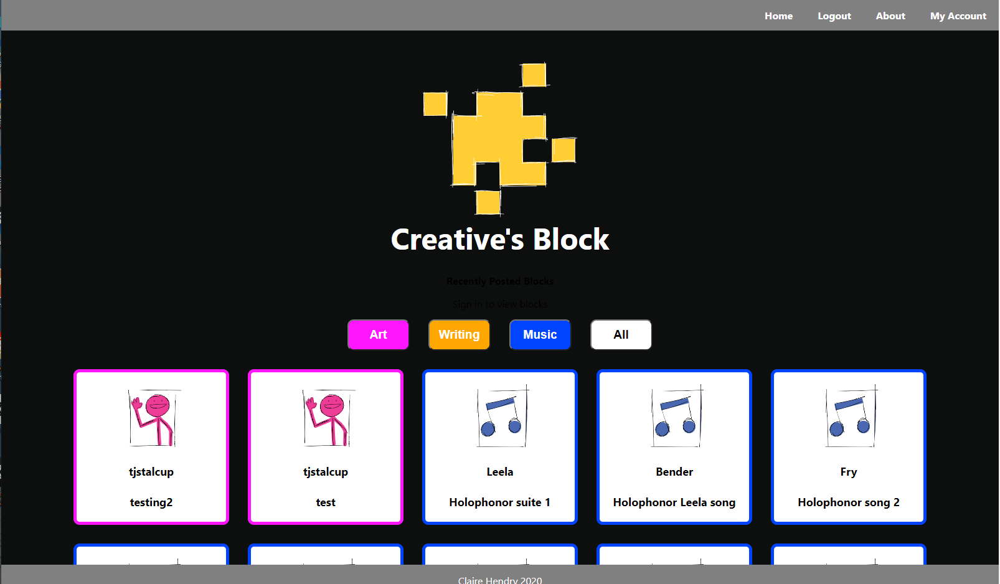
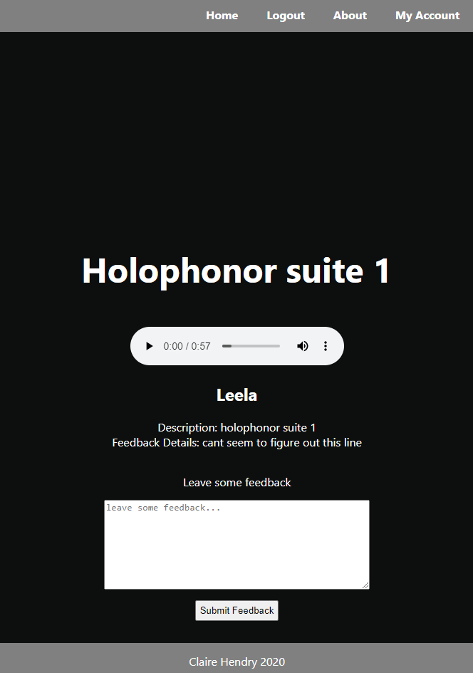

# Creative's Block
---------------------------------------------
Creative's Block is a community-based platform to provide artists, writers, and other creatives constructive feedback on projects (or "blocks") and ideas.

## Live App [Here](https://creatives-block-client.vercel.app/)

Use login User: demo_user  Password: Password@1 to try it out!

------

## API Documentation

GET /blocks/recent-blocks - See recently posted blocks from all users. If logged in, user can access block details and leave feedback.

GET /blocks/:category/:block_id - See specific block.

GET /recent-blocks/:user_name - See all blocks posted by specific user.

GET /feedback/:block_id - Get feedback on user's own blocks.

POST /feedback/:block_id - Post new feedback on other users' blocks.

POST /blocks/upload - Post new block to user's account.

POST /users - Register new user.

POST /auth/login - Login existing user.

------

## Summary

Creative's Block is a service designed to facilitate the creative process by allowing users to post work in progress projects, and gain critical feedback from a community of other creatives. Registration and uploading content are free and open to most forms of media; specifically visual art (2D, video, animation), writing, and music.

Future Features:
- Retrieve/update user information
- Upload and custom format text documents
- Update/delete blocks
- Search specific users
- Follow specific users and curate homepage experience
- Customize user's account page
- Customize block thumbnail image
- Credit system for posting new blocks

------

## Screenshots

------

## Technology Used

This service is built with ReactJS, Node, Express, and PostgreSQL.

Hosted using Heroku and Vercel.